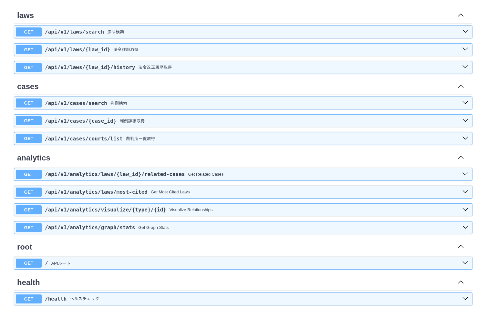
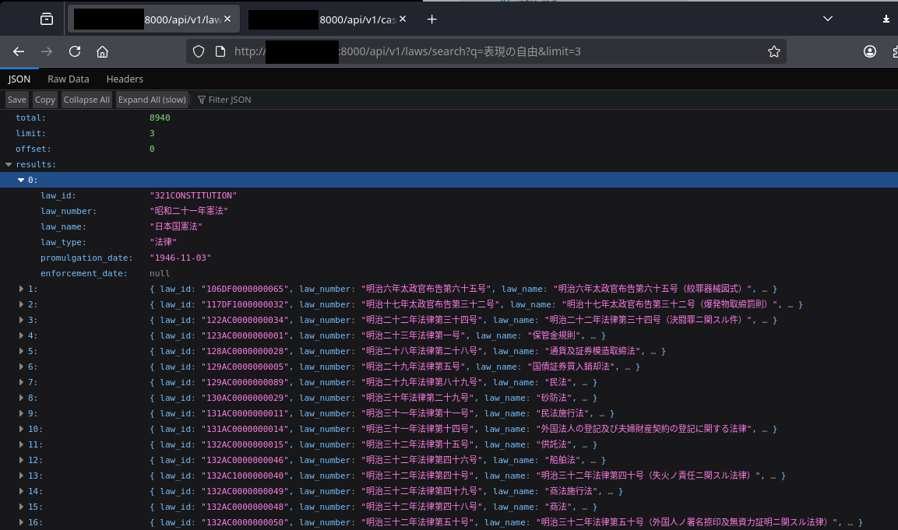
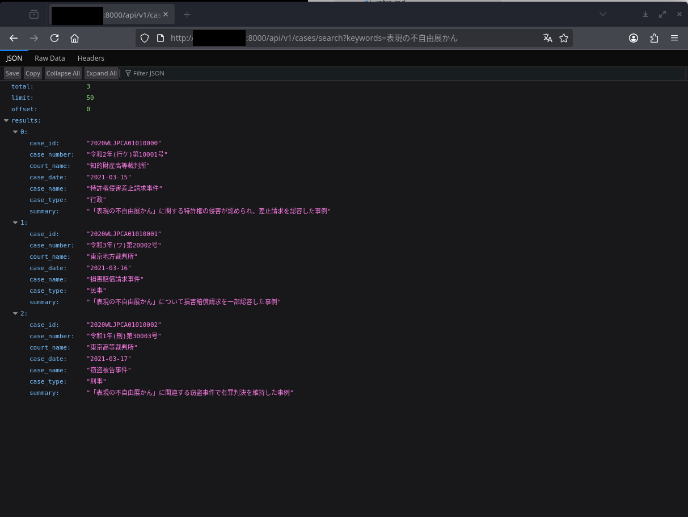

<div dir="rtl" align="right">

# 📚 e-gov API FastAPI

**سرور API پرسرعت برای دسترسی به قوانین و سوابق قضایی ژاپن**

<div dir="ltr" align="center">

[](https://fastapi.tiangolo.com/)
[](https://www.python.org/)
[](https://www.postgresql.org/)
[](https://redis.io/)
[](https://www.docker.com/)
[](https://podman.io/)
[](https://github.com/astral-sh/uv)
[](LICENSE)

[🇯🇵 日本語](../../README.md) | [🇬🇧 English](README.en.md) | [🇨🇳 简体中文](README.zh-CN.md) | [🇹🇼 繁體中文](README.zh-TW.md) | [🇷🇺 Русский](README.ru.md) | [🇮🇷 فارسی](README.fa.md) | [🇸🇦 العربية](README.ar.md)

</div>

---

## 📸 تصاویر

### مستندات API (Swagger UI)



*مستندات API تولید شده خودکار توسط FastAPI*

---

### نمونه پاسخ جستجوی قانون



*نتایج جستجو برای کلیدواژه "آزادی بیان"*

---

### نمونه پاسخ جستجوی سوابق قضایی



*نتایج جستجوی سوابق قضایی برای کلیدواژه "نمایشگاه عدم آزادی بیان کانسای"*

---

## 📖 مرور کلی

**e-gov API FastAPI** یک سرور RESTful API است که دسترسی پرسرعت به داده‌های قوانین و سوابق قضایی ژاپن را فراهم می‌کند.

این سرور با [API قوانین e-gov](https://elaws.e-gov.go.jp/) و [وب‌سایت دادگاه‌ها](https://www.courts.go.jp/) یکپارچه شده و دسترسی لحظه‌ای به جدیدترین اطلاعات حقوقی را فراهم می‌کند.

**ویژگی‌های کلیدی:**
- 🔍 جستجوی قانون، بازیابی جزئیات و تاریخچه اصلاحات
- ⚖️ جستجوی سوابق قضایی و بازیابی جزئیات
- 📊 تحلیل روابط بین قوانین و سوابق قضایی
- 🚀 عملکرد پرسرعت با حافظه نهان Redis
- 🌐 پشتیبانی از VPN/Tailscale

---

## 🎯 چرا این مورد نیاز است + چه کاری انجام می‌دهد

### مشکل

هنگام دسترسی به اطلاعات حقوقی ژاپن، چالش‌های زیر وجود دارد:

- **پراکندگی داده‌های حقوقی**: APIهای دولتی استفاده دشوار و مستندات ناکافی دارند
- **دشواری دریافت داده‌های سوابق قضایی**: API سیستماتیک وجود ندارد
- **پیچیدگی یکپارچه‌سازی داده‌ها**: مکانیزمی برای تحلیل روابط بین قوانین و سوابق قضایی وجود ندارد

### راه‌حل

این سرور API چندین منبع داده را یکپارچه کرده و دسترسی توسعه‌دهندگان به اطلاعات حقوقی ژاپن را آسان می‌کند.

**چه کاری انجام می‌دهد:**
- دسترسی یکپارچه به پایگاه‌های داده قانونی
- جستجو و بازیابی داده‌های سوابق قضایی
- تحلیل روابط بین قوانین و سوابق قضایی
- زمان پاسخ سریع (قابلیت حافظه نهان)

**موارد استفاده:**
- بک‌اند برای برنامه‌های مشاوره حقوقی
- API پایه برای محصولات LegalTech
- تحلیل و تحقیق داده‌های حقوقی
- سیستم‌های ردیابی خودکار اصلاحات قانون

---

## 🚀 نصب

### پیش‌نیازها

- Python 3.12+
- Docker یا Podman
- uv (مدیر بسته)

### روش 1: راه‌اندازی با Docker/Podman (توصیه شده)

<div dir="ltr" align="left">

```bash
# کلون کردن مخزن
git clone https://github.com/clearclown/e-gov-api-fastAPI.git
cd e-gov-api-fastapi

# پیکربندی متغیرهای محیطی
cp .env.example .env

# راه‌اندازی
podman compose up -d
# یا
docker compose up -d

# تأیید عملکرد
curl http://localhost:8000/health
```

</div>

### روش 2: راه‌اندازی محیط توسعه با uv

<div dir="ltr" align="left">

```bash
# نصب uv
curl -LsSf https://astral.sh/uv/install.sh | sh

# ایجاد محیط مجازی
uv venv

# فعال‌سازی محیط مجازی
source .venv/bin/activate  # Linux/Mac
.venv\Scripts\activate     # Windows

# نصب وابستگی‌ها
uv pip install -e .

# راه‌اندازی سرور توسعه
uv run uvicorn app.main:app --host 0.0.0.0 --port 8000 --reload
```

</div>

### نقاط دسترسی

<div dir="ltr" align="left">

- **مستندات API**: http://localhost:8000/docs
- **ReDoc**: http://localhost:8000/redoc
- **بررسی سلامت**: http://localhost:8000/health

</div>

---

## 🗑️ حذف نصب

### محیط Docker/Podman

<div dir="ltr" align="left">

```bash
# توقف و حذف سرویس‌ها
podman compose down

# حذف کامل شامل volumeها
podman compose down -v

# حذف imageها
podman rmi e-gov-api-fastapi-app
```

</div>

### محیط uv

<div dir="ltr" align="left">

```bash
# حذف محیط مجازی
rm -rf .venv

# پاک کردن حافظه نهان
uv cache clean
```

</div>

---

## 📚 مستندات

### فناوری‌های اصلی

| دسته‌بندی | فناوری |
|---------|---------|
| **چارچوب** | FastAPI |
| **زبان** | Python 3.12+ |
| **پایگاه داده** | PostgreSQL 16 + pgvector |
| **حافظه نهان** | Redis 7 |
| **مدیر بسته** | uv |
| **کانتینر** | Docker / Podman |
| **APIهای خارجی** | API قوانین e-gov، دادگاه‌ها |

### معماری

<div dir="ltr" align="left">

```
┌─────────────┐
│   کلاینت    │
└──────┬──────┘
       │
       ▼
┌─────────────────────────────┐
│   برنامه FastAPI            │
│  ┌──────────────────────┐  │
│  │  endpointهای قانون  │  │
│  │  endpointهای سوابق  │  │
│  │  endpointهای تحلیل  │  │
│  └──────────────────────┘  │
└──┬───────────┬──────────┬───┘
   │           │          │
   ▼           ▼          ▼
┌──────┐  ┌────────┐  ┌─────────┐
│Redis │  │Postgres│  │e-gov API│
│Cache │  │Database│  │Courts DB│
└──────┘  └────────┘  └─────────┘
```

</div>

**جریان داده:**
1. کلاینت درخواست API ارسال می‌کند
2. FastAPI درخواست را پردازش می‌کند
3. بررسی حافظه نهان Redis (پاسخ فوری در صورت یافتن)
4. در صورت عدم یافتن در حافظه نهان، دریافت داده از APIهای خارجی (e-gov/دادگاه‌ها)
5. ذخیره داده‌های دریافتی در PostgreSQL
6. بازگرداندن پاسخ و ذخیره در حافظه نهان Redis

### زیرساخت

**ساختار فایل:**

<div dir="ltr" align="left">

```
e-gov-api-fastapi/
├── app/                    # کد برنامه
│   ├── api/               # API endpointها
│   ├── core/              # تنظیمات اصلی و اتصال DB
│   ├── services/          # منطق کسب‌وکار
│   └── main.py            # نقطه ورود
├── infra/
│   └── podmanOrDocker/    # پیکربندی Docker/Podman
│       ├── Dockerfile     # نسخه کامل (با ویژگی‌های AI)
│       └── Dockerfile.lite # نسخه سبک (فقط API)
├── docs/                   # مستندات
│   ├── pics/              # تصاویر
│   └── readmeLang/        # README چندزبانه
├── scripts/               # اسکریپت‌های کمکی
├── docker-compose.yml     # پیکربندی اصلی Compose
├── pyproject.toml         # پیکربندی پروژه
└── .env                   # متغیرهای محیطی
```

</div>

**استفاده از منابع:**

نسخه سبک (پیش‌فرض):
- سرور API: ~600MB
- PostgreSQL: ~500MB
- Redis: ~50MB
- **مجموع:** ~1.2GB

نسخه کامل (با ویژگی‌های AI):
- سرور API: ~3-4GB (PyTorch + CUDA)
- PostgreSQL: ~500MB
- Redis: ~50MB
- **مجموع:** ~4-5GB

### شبکه

**روش‌های دسترسی:**

همه سرویس‌ها روی `0.0.0.0` گوش می‌دهند و از طریق موارد زیر قابل دسترسی هستند:

<div dir="ltr" align="left">

1. **Localhost**: `http://localhost:8000`
2. **شبکه محلی**: `http://[IP میزبان]:8000`
3. **Tailscale/VPN**: `http://[IP Tailscale]:8000`

</div>

**پیکربندی پورت (قابل تغییر در .env):**
- سرور API: `8000`
- PostgreSQL: `5432`
- Redis: `6379`

**پشتیبانی VPN/Tailscale:**

اتصال 0.0.0.0 امکان دسترسی از راه دور را فراهم می‌کند.

### نقشه راه

**فازهای 1 و 2: ویژگی‌های اصلی** ✅ **تکمیل شده**
- [x] پیاده‌سازی کلاینت e-gov API
- [x] endpointهای جستجو و بازیابی جزئیات قانون
- [x] قابلیت scraping و جستجوی سوابق قضایی
- [x] پیاده‌سازی حافظه نهان Redis
- [x] یکپارچه‌سازی پایگاه داده PostgreSQL
- [x] پشتیبانی کامل Docker/Podman

**فاز 3: یکپارچه‌سازی AI** 🔄 **برنامه‌ریزی شده**
- [ ] AgenticRAG برای جستجوی معنایی
- [ ] جستجوی برداری (استفاده از pgvector)
- [ ] یکپارچه‌سازی Claude API
- [ ] پرسش و پاسخ زبان طبیعی
- [ ] پیاده‌سازی سرور MCP

**فاز 4: تحلیل پیشرفته** 🔄 **برنامه‌ریزی شده**
- [ ] بصری‌سازی گراف روابط قانون-سوابق قضایی
- [ ] تحلیل شبکه ارجاعات سوابق قضایی
- [ ] تولید خلاصه خودکار
- [ ] رابط مشاوره حقوقی به صورت چت

---

## 🤝 مشارکت

مشارکت در پروژه خوش‌آمدید!

**گزارش باگ و درخواست ویژگی:**

لطفاً در [GitHub Issues](https://github.com/clearclown/e-gov-api-fastAPI/issues) گزارش کنید.

**Pull Requestها:**

1. این مخزن را Fork کنید
2. یک branch ویژگی ایجاد کنید
3. تغییرات خود را commit کنید
4. به branch push کنید
5. یک Pull Request ایجاد کنید

**راهنمای توسعه:**
- سبک کد: پیروی از PEP 8
- پیام‌های commit: فرمت Conventional Commits
- تست: همیشه تست‌ها را برای ویژگی‌های جدید اضافه کنید

---

## 📚 منابع

### مستندات رسمی
- [FastAPI](https://fastapi.tiangolo.com/)
- [مشخصات API قوانین e-gov](https://elaws.e-gov.go.jp/apitop/)
- [uv - مدیر بسته Python](https://github.com/astral-sh/uv)
- [PostgreSQL](https://www.postgresql.org/)
- [Redis](https://redis.io/)

### پروژه‌های مرتبط
- [pgvector](https://github.com/pgvector/pgvector) - افزونه جستجوی برداری PostgreSQL
- [Claude API](https://docs.anthropic.com/) - Anthropic Claude AI

### منابع داده
- [پایگاه داده قوانین e-gov](https://elaws.e-gov.go.jp/)
- [وب‌سایت دادگاه‌ها](https://www.courts.go.jp/)

---

## ⚖️ مجوز

این پروژه تحت مجوز دوگانه ارائه می‌شود:

### مجوز MIT
ایده‌آل برای استفاده شخصی و تجاری

نگاه کنید به [LICENSE-MIT](../../LICENSE-MIT)

### مجوز Apache 2.0
برای استفاده سازمانی و حفاظت از اختراعات

نگاه کنید به [LICENSE-APACHE](../../LICENSE-APACHE)

**می‌توانید هر مجوزی که مناسب نیازهای شماست را انتخاب کنید.**

---

<div dir="ltr" align="center">

**⭐ اگر این پروژه مفید بود، لطفاً یک ستاره بدهید!**

Made with ❤️ by [clearclown](https://github.com/clearclown)

📧 تماس: clearclown@gmail.com

</div>

</div>
